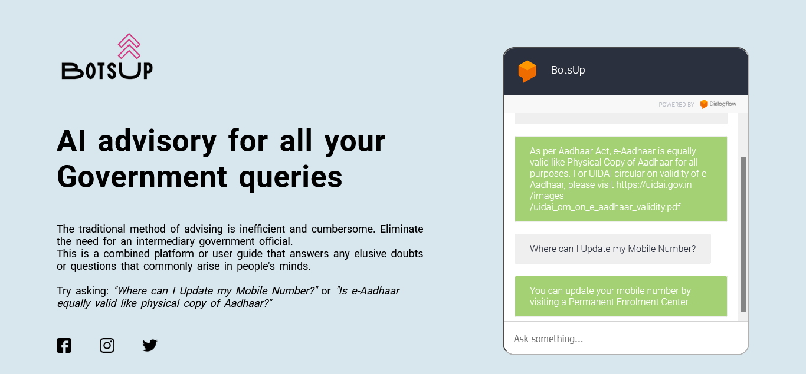

# BotsUp

## What is BotsUp?

BotsUp is a combined platform or user guide that answers any elusive doubts or questions that commonly arise in people's minds. The user assistant is easy to use for all government-related information and accessible to anyone with an interactive smart device.

### [Deployment Link](https://sanket-mathur.github.io/BotsUp/)

## Designed for Comfort
